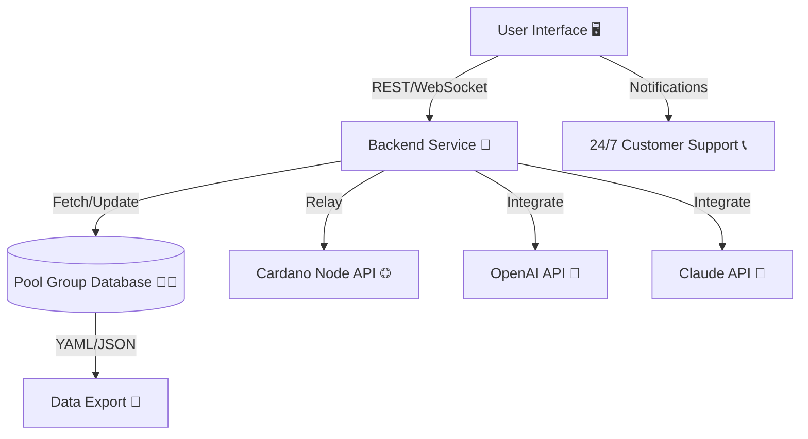

# Cardano Pool Group Dashboard 🏊‍♂️📊

**

> **Efficiently manage, visualize, and collaborate on Cardano pool groups within the global ecosystem!**

---

## 🌐 Introduction

**Cardano Pool Group Dashboard** presents a unified, dynamic, and interactive platform for Cardano stakers, pool operators, and enthusiasts aiming to enrich pool group discovery, analysis, and transparency. Inspired by the collaborative spirit of the Cardano ecosystem, this project provides an intuitive and insightful hub for tracking, profiling, and optimizing relay and purpose-driven pool alliances.

With deep integration of both OpenAI and Claude APIs, Cardano Pool Group Dashboard brings conversational insights, smart notifications, and AI-enhanced recommendations to your fingertips.

If you participate in Cardano’s decentralized revolution, this tool accelerates your journey from curious observer to well-informed ecosystem navigator.

---

## 🚀 Features

- **📋 Dynamic Pool Group Explorer**: Instantly search, filter, and visualize all registered Cardano pool groups.
- **💠 Example Configurations**: Jumpstart your participation with ready-to-use, customizable YAML and JSON configuration templates.
- **🤖 AI Insights**: Leverage OpenAI and Claude for on-demand group analysis, risk assessment, and newcomer guidance.
- **🌍 Multilingual UI**: Engage with the dashboard in your language—globalization embraced!
- **📡 Real-Time Telemetry**: Visualize pool statistics, relay health, and historical uptime trends.
- **🪢 Responsive UI**: Elegant interfaces adapt to every device, enhancing the Cardano experience everywhere.
- **🔔 Instant Notifications**: Get alerts on significant pool group events or ecosystem changes.
- **📞 24/7 Customer Support**: Interactive guides and responsive help desk through the dashboard interface.
- **🗃️ Rich API Integration**: Direct access to Cardano’s blockchain for up-to-date group and performance data.
- **🗺️ Group Collaboration Tools**: Securely communicate and coordinate within and across pool groups.
- **🛡️ Security First**: Non-custodial, privacy-centric, and open source under the MIT License.

---

## 📀 Download

Enjoy smooth sailing! Get the latest release:

**

---

## 🎯 Use Cases

- Cardano community analysts seeking trusted, real-time group mappings.
- Pool operators coordinating relay partnerships.
- Delegators comparing sustainability, performance, and philosophies of pool groups.
- Education hubs introducing newcomers to the social architecture of Cardano’s pools.

---

## 🏁 Getting Started

1. **Download** the latest package from the link above.
2. **Configure** your personal or organization profile (see example below).
3. **Run** from your preferred environment (see console usage).
4. Begin exploring, analyzing, and collaborating on Cardano pool groups!

---

## 📄 Example Profile Configuration (`pool_group_profile.yaml`)

  pool_group:
    name: Cardano Steward Alliance
    description: Champions of decentralized relay distribution, governance, and education.
    members:
      - ticker: CSA
        pool_id: pool1exampleid1
        website: https://csa.example.org
      - ticker: EDUX
        pool_id: pool1exampleid2
        website: https://eduxpool.io
    metadata_url: https://alliance-metadata.example.org/pool_meta.json
    languages_supported:
      - en
      - de
      - fr
      - zh
    region: "Global"
    contact:
      discord: "https://discord.gg/cardanoalliances"
      telegram: "https://t.me/carda_alliances"

---

## ⌨️ Example Console Invocation

  $ cardano-poolgroups dashboard --config=pool_group_profile.yaml

  # Start the local dashboard interface for custom group viewing, stats, and management.

---

## 🏝️ Feature Oasis

1. **Pool Group Browser** – Discover, compare, and filter by geography, mission, or stake size.
2. **AI Chat for Groups** – Ask OpenAI or Claude about group philosophies, sustainability, and best-fit recommendations.
3. **Automated Group Health Checks** – Uptime, block production, relay performance.
4. **Secure API & Export** – Export group lists or pool affiliations in common formats.
5. **Multilingual Mode** – Language selector for global engagement and onboarding.

---

## 📊 Mermaid Diagram

The architecture of Cardano Pool Group Dashboard:

---

## 🖥️ OS Compatibility Table

| OS         | Dashboard UI | CLI Tools | API Integration | Status        |
|------------|:------------:|:---------:|:---------------:|:-------------|
| 🪟 Windows |      ✔️      |     ✔️    |       ✔️        | Verified      |
| 🐧 Linux   |      ✔️      |     ✔️    |       ✔️        | Verified      |
| 🍏 macOS   |      ✔️      |     ✔️    |       ✔️        | Verified      |
| 📱 Mobile  |      ✔️      |     ❌    |       ✔️        | UI-Only       |

---

## 🤖 AI Integration Details

| Service   | Capability Highlight                                                         |
|-----------|-----------------------------------------------------------------------------|
| OpenAI    | Group philosophy Q&A, smart search, delegate suggestions, instant summaries  |
| Claude    | Natural language group analysis, comparative reporting, onboarding FAQ       |

APIs are securely accessed (bring your own API token). All queries protected by privacy-first data policies.

---

## 🌟 SEO-Smart Benefits

- Easily **discover Cardano pool groups**, alliances, and strategies.
- **Optimize delegation** choices with AI-powered recommendations.
- **Visualize stake distribution, relay clusters, and performance** for Cardano pools.
- **Collaborate and coordinate** among similar-mission or geolocated relay groups.
- **Empower Cardano community growth**: from technical newcomers to seasoned pool operators.

---

## ⚓ Disclaimer

*Cardano Pool Group Dashboard is provided for informational and community collaboration purposes only. All data is sourced from public blockchain or user-contributed metadata. Always exercise independent judgment when delegating ADA or managing pool operations.*

No custodial services, guarantees, or financial advice. **Stay sovereign!**

---

## 📝 License

*This project is licensed under the [MIT License](https://opensource.org/licenses/MIT). You are encouraged to remix and build upon this work, respecting the open ethos of the Cardano ecosystem (© 2026).*

---

## 💬 Community & Support

Need help or want to cheer on the Cardano mission together? Use the dashboard’s live chat, or get involved via our support channels listed inside the app.

---

## 📥 Download Again

Return here any time for the latest version:

**

---

**Unite, discover, and champion Cardano with Cardano Pool Group Dashboard!**

© 2026 Cardano Pool Group Dashboard – Democratizing decentralized ecosystem analytics.